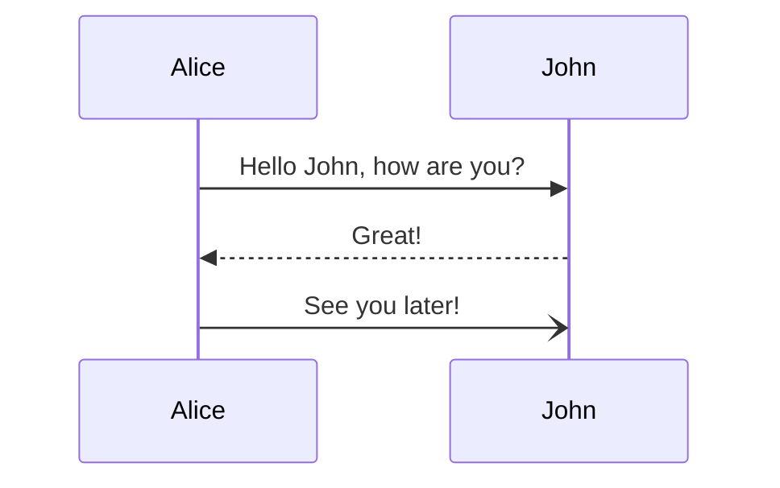

1. TOC
{:toc}

## What is covered


Type checking and inheritance. 
Rust has a pretty comprehensive type checking system

| Month     |  Savings  |
| :-------- | :-------: |
| January   | $250      |
| February  | $80       |
| March     | $420      |


```rust
fn first_name() {
    println!("John");
}
```

An example of a program that uses conditional flow

```rust
// Topic: Decision making with match
//
// Program requirements:
// * Display "it's true" or "it's false" based on the value of a variable
//
// Notes:
// * Use a variable set to either true or false
// * Use a match expression to determine which message to display

fn main() {
    // * Display "it's true" or "it's false" based on the value of a variable
    // * Use a variable set to either true or false
    let my_bool: bool = true;

    // * Use a match expression to determine which message to display
    match my_bool {
        true => println!("it's true"),
        false => println!("it's false"),
    }
}
```

```rust
fn main() {
    // * Use a variable set to any integer
    let var: i32 = 3;

    // * Use a match expression to determine which message to display
    match var {
        1 => println!("one"),
        2 => println!("two"),
        3 => println!("three"),
        _ => println!("other"),
    }
    // * Use an underscore (_) to match on any value
}
```


## Loops


```rust
// Topic: Looping using the loop statement
//
// Program requirements:
// * Display "1" through "4" in the terminal
//
// Notes:
// * Use a mutable integer variable
// * Use a loop statement
// * Print the variable within the loop statement
// * Use break to exit the loop

fn main() {
    // * Use a mutable integer variable
    let mut n: i32 = 1;

    // * Use a loop statement
    loop {
        // * Print the variable within the loop statement
        println!("{:?}", n);
        n += 1;
        // * Use break to exit the loop
        if n > 4 {
            break;
        }
    }
}
```

```rust
// Topic: Looping using the while statement
//
// Program requirements:
// * Counts down from 5 to 1, displays the countdown
//   in the terminal, then prints "done!" when complete.
//
// Notes:
// * Use a mutable integer variable
// * Use a while statement
// * Print the variable within the while loop
// * Do not use break to exit the loop

fn main() {
    let mut counter: i32 = 5;

    while counter > 0 {
        println!("{:?}", counter);
        counter -= 1;
    }
    println!("done!");
}
```



## Overview

<!-- Overview -->

**_Further Reading_**

<!-- \[1\] Comment -->

<br>
## Read more [posts](/blog/)
{:.read-more .no_toc}

<!-- Links  -->
<!-- [Link]: https://leetcode.com 
[Link 2]: https://leetcode.com -->